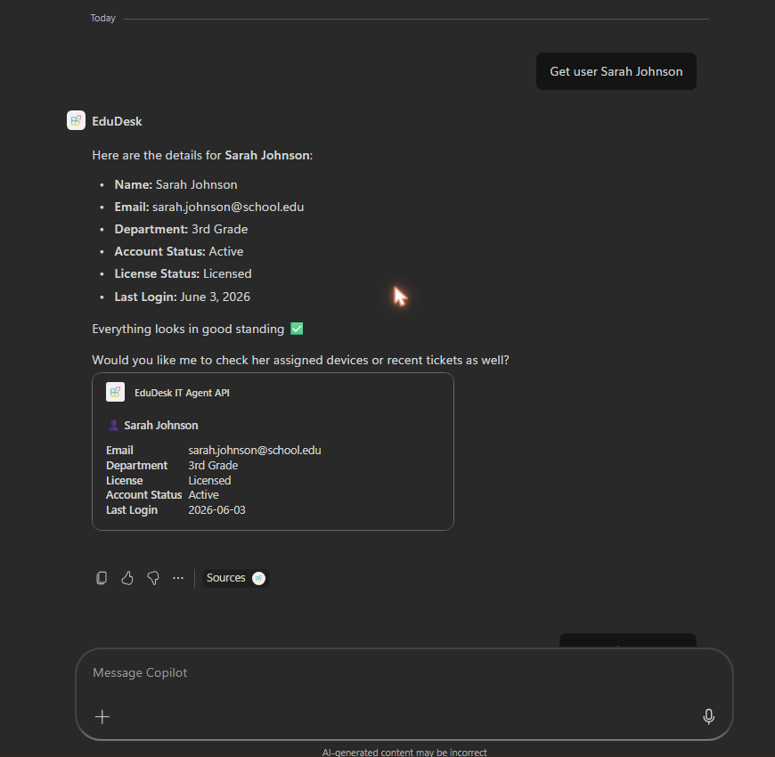
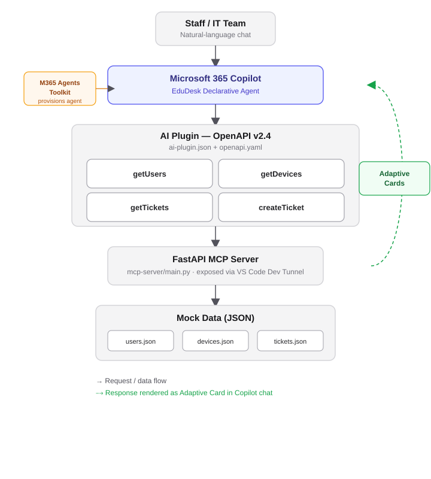

# EduDesk

**A Microsoft 365 Copilot declarative agent that acts as an IT helpdesk assistant for charter schools.**

Built for the Microsoft Agents League Hackathon / AI Skills Fest — Enterprise Agents track.

---

## What it does

Small charter schools often run lean IT teams without dedicated helpdesk software. EduDesk brings device management, staff account lookups, and ticket tracking directly into Microsoft 365 Copilot — staff and IT can ask natural-language questions and get structured answers (and create tickets) without leaving the chat.


EduDesk is a **declarative agent** with an **API plugin** that calls a custom FastAPI backend (the "EduDesk IT Agent API") via four actions:

| Action | What it does |
| --- | --- |
| `getUsers` | Look up a staff member's account status, license, department, and last login |
| `getDevices` | Look up a device (Chromebook/laptop) by serial number, status, and assignment |
| `getTickets` | Look up existing IT support tickets by ID or status |
| `createTicket` | File a new IT support ticket on behalf of a staff member |

Each action returns data through a **custom Adaptive Card**, so results render as clean, structured cards inside Copilot rather than raw text.

## Demo



A full walkthrough script covering all four actions (user lookup → device lookup → existing ticket lookup → new ticket creation) is in [`demo-script.md`](demo-script.md).

## Architecture



```
Microsoft 365 Copilot (declarative agent)
        │
        ▼
appPackage/ai-plugin.json  (OpenAPI plugin manifest, v2.4)
        │  - 4 functions: getUsers, getDevices, getTickets, createTicket
        │  - each bound to a static Adaptive Card template
        ▼
appPackage/apiSpecificationFile/openapi.yaml
        │  - OpenAPI spec describing the 4 endpoints
        ▼
FastAPI MCP server (mcp-server/main.py)
        │  - exposed via VS Code Dev Tunnel for Copilot to reach
        ▼
mcp-server/mock_data/*.json  (devices, users, tickets)
```

## Repo structure

| Path | Contents |
| --- | --- |
| `appPackage/` | Declarative agent manifest, AI plugin manifest, OpenAPI spec, and Adaptive Card templates |
| `appPackage/adaptiveCards/` | Custom Adaptive Cards for each of the 4 actions |
| `mcp-server/` | FastAPI backend serving the IT helpdesk API and mock data |
| `m365agents.yml` / `m365agents.local.yml` | Microsoft 365 Agents Toolkit project files (dev / local environments) |
| `env/` | Environment configuration for the Agents Toolkit |
| `evals/` | Sample evaluation prompts for the Copilot Agent Evaluations CLI |
| `demo-script.md` | Narration script for the demo video |

## Running locally

> **Prerequisites**
> - [Node.js](https://nodejs.org/) (18, 20, or 22)
> - Python 3.10+
> - A [Microsoft 365 account for development](https://docs.microsoft.com/microsoftteams/platform/toolkit/accounts) with a Copilot license
> - [Microsoft 365 Agents Toolkit](https://aka.ms/teams-toolkit) VS Code extension (v5+)

1. **Start the backend API**

   ```bash
   cd mcp-server
   pip install -r requirements.txt
   uvicorn main:app --reload --port 8000
   ```

2. **Expose it via a tunnel** (e.g. VS Code Dev Tunnel) and update the `url` in `appPackage/apiSpecificationFile/openapi.yaml` to match.

3. **Provision the agent** — in the Microsoft 365 Agents Toolkit panel, select the `local` environment and run **Teams: Provision**.

4. **Open the agent in Copilot** and start chatting — try the prompts in `demo-script.md`.

## Example prompts

- "Get user Sarah Johnson"
- "Get device 5XJ9K2L"
- "Get TKT-001"
- "Submit a ticket for Marcus Williams - his account is disabled and he can't log into Google Classroom for PE class"

## Tech stack

- Microsoft 365 Copilot declarative agents + AI plugin (OpenAPI v2.4)
- Adaptive Cards 1.4
- FastAPI (Python)
- Microsoft 365 Agents Toolkit
